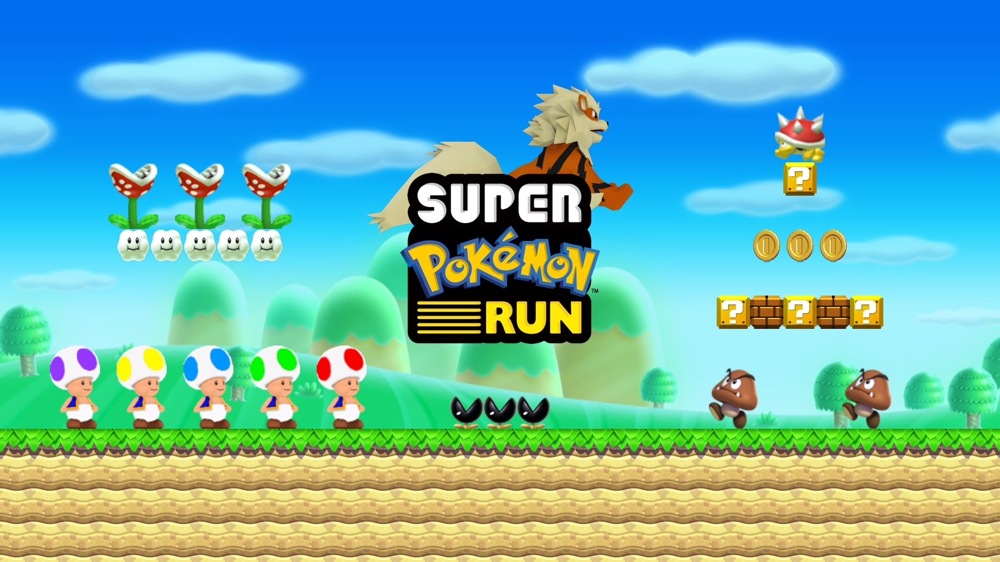
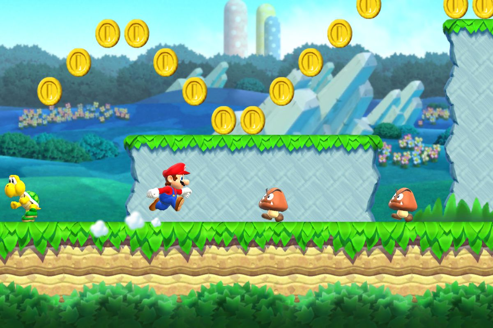
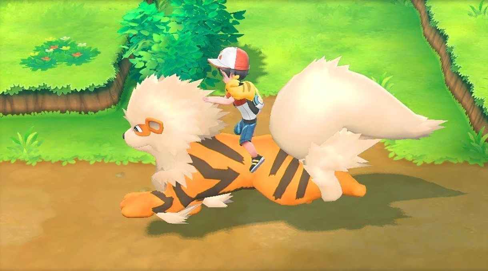
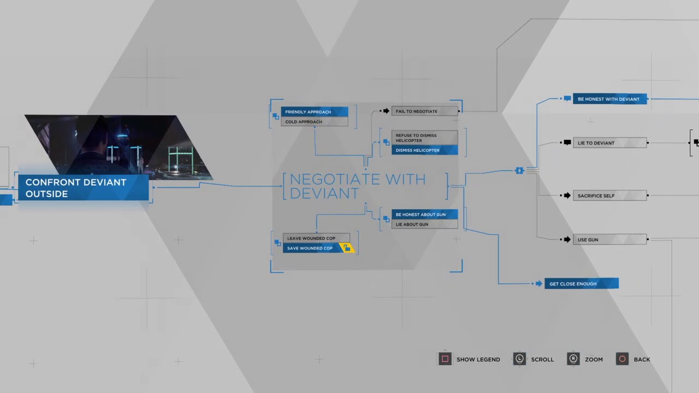
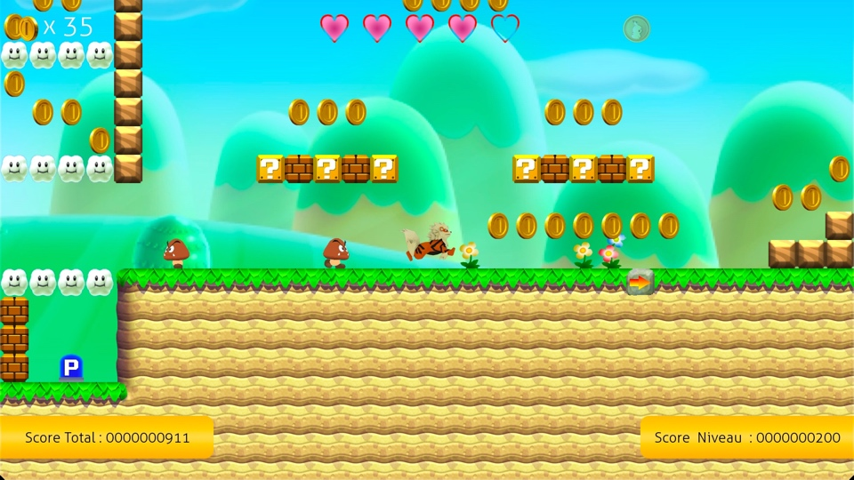

# Super Pokémon Run

After developing BomberMario, my first real project, I wanted to create a video game with a completely new gameplay, Super Pokémon Run. At that time, [Super Mario Run](https://supermariorun.com/en/index.html) had just been released and everyone was talking about it and playing it. I then had the idea to create my own version of the game, but with a touch of originality that would make it different from the original game.

To do this, I thought about adding Pokémon, another universe I was a fan of, which would change the dimension of the gameplay. By assigning each Pokémon a unique feature to it, and creating levels that take advantage of these features, I encouraged the player to alternate between different Pokémon to progress. And to determine how much power to assign to each Pokémon, I only had to look at its type :

• A Pokémon Fire is able to swim in the lava.

• A Pokémon Fight has enough strength to destroy the brick blocks.

• A Pokémon Steel can walk on spikes and peaked enemies.

After imagining these different abilities, I still had to cast the different Pokémon that will integrate my future game. Except that this casting itself requires many choices to be made regarding the continuation of the project. First of all, how many different Pokémon will be present ? Then, will they all be available at the beginning, or gradually during the levels ?

In fact, these are the questions I am asking myself today, looking at this project, which is now complete. But at that moment, many other questions were spinning in my head… For example, I had imagined for a while that the player would play the role of a trainer who would ride on the Pokémon's back. So when you look at the final version of Super Pokémon Run, you can see that there has been a long way since those first ideas…

Finally, Super Pokémon Run has 40 levels, spread over 8 distinct worlds : Plain, Desert, Snow, … I have chosen to include a new Pokémon in each new world. This means that the first world (Plain) has only one Pokémon, so that the player can slowly learn the basics of the game. The second world (Desert) introduces a new Pokémon to highlight possible changes. The third world (Snow) adds a third Pokémon, and so on… The game has 8 different Pokémon, gradually distributed among the 40 levels of the game, themselves equally divided into 8 distinct worlds.

Except that unlike BomberMario, Super Pokémon Run levels are much more complex, and therefore take longer to design. I couldn't just create a large area where the player could move and include a few traps to the right and left. No, I had to create real levels, place the flag at the end, include passages requiring the player to change Pokémon, add enemies, … Then it was certainly quite simple for the first levels. But as the number of Pokémon increased, I had to create more and more complex levels, which took me more and more time…

Especially since Super Pokémon Run has a considerable amount of elements that can interact with each other, and this encourages the appearance of many bugs. A project like BomberMario has about twenty events that can occur independently. Even if it is long, it is possible to test the chain reaction of each of these events. But if there are many more of them, the situation can quickly become uncontrollable. Super Pokémon Run contains more than a hundred different events, and it is impossible to test the behavior that each of them causes on all the others…

Let's take an example : The player can collect pieces, or press a P Switch to turn all the pieces into a block of bricks, and vice-versa, for a few seconds. Each of these events, taken independently, is very easy to program. Except that if a player collects a piece after pressing a P Switch, it is important not to show a block in his position when the stopwatch of the P Switch has run out. This is of course a detail, but there is such a large quantity that it is difficult not to forget…

I also had to deal with many adventures on multiplayer features. During an online game, the application makes many requests to a server, in order to synchronize the players and their data. But this synchronization requires great rigidity, so as not to mix the data, and to ensure that each player present in each session receives what he expects.

Beyond its success, Super Pokémon Run has taught me that a fully customized project is always much more interesting, whether for its development, or for the players who will discover it. After almost two years of work, Super Pokémon Run is finally available and invites you to play 8 Pokémon with unique abilities, in 40 levels that will introduce you to the Mushroom Kingdom like you've never seen before !

If you want to see the result and the many improvements I've been able to make, don't wait any longer and download Super Pokémon Run now !